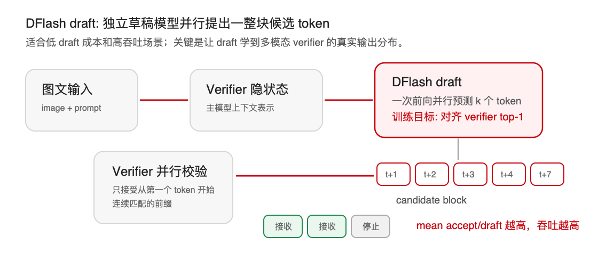
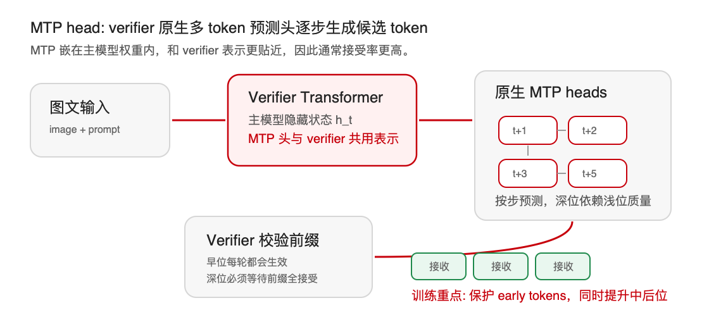

# Qwen3.5 多模态投机解码接受率提升: 从 DFlash 到 MTP

**日期**: 2026-06-29  
**范围**: Qwen3.5-9B 多模态模型与 Qwen3.5-122B-A10B 多模态 MoE 模型  
**场景**: vLLM speculative decoding，spec=7，greedy decoding，ALLaVA 域内 + MMStar 域外

## 0. 最终结论先看

我们先把 `original MTP`、`original DFlash`、`baseline`、`trained MTP`、`trained DFlash` 放在一张表里。红色行为我们训练或权重插值后的结果；提升比例均相对各自原始方法计算。

### 0.1 Qwen3.5-9B: ALLaVA 域内主结果

| 方法 | QPS(token/s) | mean accept/draft(token/draft) | 相对 no-spec QPS | 相对原始方法提升 |
|---|---:|---:|---:|---|
| baseline(no spec) | 30.139 | n/a | 1.00x | - |
| original DFlash | 61.375 | 1.945 | 2.04x | - |
| original MTP | 66.4 | 2.916 | 2.20x | - |
| <span style="color:#C7000B"><strong>trained DFlash</strong></span> | <span style="color:#C7000B"><strong>73.779</strong></span> | <span style="color:#C7000B"><strong>2.666</strong></span> | <span style="color:#C7000B"><strong>2.45x</strong></span> | <span style="color:#C7000B"><strong>QPS +20.2%, accept +37.0%</strong></span> |
| <span style="color:#C7000B"><strong>trained MTP</strong></span> | <span style="color:#C7000B"><strong>70.4</strong></span> | <span style="color:#C7000B"><strong>3.142</strong></span> | <span style="color:#C7000B"><strong>2.34x</strong></span> | <span style="color:#C7000B"><strong>QPS +6.1%, accept +7.7%</strong></span> |

我们在 9B 上看到一个很有意思的结论: **trained DFlash 的接受长度仍低于 MTP，但 QPS 最高**。原因是 DFlash draft 更便宜，在 9B 这个规模上，低 draft 成本足以抵消部分接受率差距。

### 0.2 Qwen3.5-122B-A10B: ALLaVA 域内主结果

| 方法 | QPS(token/s) | mean accept/draft(token/draft) | 相对 no-spec QPS | 相对原始方法提升 |
|---|---:|---:|---:|---|
| baseline(no spec) | 11.756 | n/a | 1.00x | - |
| original DFlash | 26.645 | 1.753 | 2.27x | - |
| original MTP | 34.248 | 3.008 | 2.91x | - |
| <span style="color:#C7000B"><strong>trained DFlash</strong></span> | <span style="color:#C7000B"><strong>30.918</strong></span> | <span style="color:#C7000B"><strong>2.283</strong></span> | <span style="color:#C7000B"><strong>2.63x</strong></span> | <span style="color:#C7000B"><strong>QPS +16.0%, accept +30.2%</strong></span> |
| <span style="color:#C7000B"><strong>trained MTP(alpha=0.5 soup)</strong></span> | <span style="color:#C7000B"><strong>35.806</strong></span> | <span style="color:#C7000B"><strong>3.314</strong></span> | <span style="color:#C7000B"><strong>3.05x</strong></span> | <span style="color:#C7000B"><strong>QPS +4.5%, accept +10.2%</strong></span> |

我们在 122B 上看到的结论反过来: **MTP 同时拿到最高接受长度和最高 QPS**。大模型 verifier 前向代价更高，MTP 高接受长度带来的收益更明显。若只看 ALLaVA 域内最优点，`beta=0.6` 纯微调 MTP 可达到 **36.82 token/s、3.419 mean accept/draft**，相对 native **QPS +7.3%、accept +11.5%**；表中采用 `alpha=0.5 soup` 是因为它同时修复了 MMStar 域外回退，更适合通用服务。

### 0.3 一句话总结

**DFlash 是“相对提升最大”的路线，MTP 是“绝对接受率最高”的路线。**
我们认为 DFlash 开源 draft 原本没有多模态数据训练，自蒸馏后补齐了图文分布，所以提升显著；MTP 原生头已经有多模态能力，起点更高，因此提升幅度较小，但最终接受长度仍然最高。

## 1. 背景: 投机解码为什么能加速

我们先从推理瓶颈说起。多模态大模型推理中的主要成本来自逐 token 自回归解码。投机解码(speculative decoding)的核心思想是: 先用一个 draft 机制一次提出多个候选 token，再由主模型 verifier 一次前向并行校验这些候选 token。只要候选 token 与 verifier 的 greedy 输出一致，我们就可以一次接受多个 token。

因此，投机解码的吞吐近似由两个因素决定:

```text
端到端吞吐 ~= verifier 每轮成本不变时的平均接受长度 / draft 额外成本
```

我们最关注的指标是 `mean accept/draft`，即每轮投机平均被 verifier 接受多少个 token。它不是 0 到 1 之间的概率，而是 token/draft 单位的平均接受长度。下文所有“接受率提升”若无特殊说明，均指这个指标。

## 2. DFlash 和 MTP 分别是什么

### 2.1 DFlash: 独立 draft 模型，一次并行预测候选块



我们可以把 DFlash 理解成独立于 verifier 的 draft 模块。它根据当前上下文和 verifier 隐状态，一次性并行预测一整块候选 token，例如 spec=7 时预测 7 个 token。随后 verifier 对这 7 个 token 做并行校验，并从第一个 token 开始接受连续匹配的前缀。

DFlash 的优势是 **draft 成本低、并行度高**。如果 draft 足够便宜，即使它的接受长度略低于 MTP，也可能在端到端 QPS 上更快。9B 实验正是这个现象: trained DFlash 接受长度低于 MTP，但 QPS 高于 MTP。

DFlash 的问题也很直接: **开源 DFlash draft 主要缺少多模态分布**。我们判断，文本场景中的 draft 不一定知道图像条件会如何改变 verifier 的输出，因此在 ALLaVA 这类图文输入上，原版 DFlash 的接受长度明显偏低。

### 2.2 MTP: verifier 原生多 token 预测头



我们再看 MTP(Multi-Token Prediction)。它不是独立 draft，而是 verifier 原生权重里自带的多 token 预测头。它利用 verifier 的隐藏状态逐步预测后续 token。因为 MTP 头与 verifier 表示更贴近，通常可以获得更高的接受长度。

MTP 的优势是 **接受率上限高**，尤其在 122B 这种 verifier 成本很高的场景中，高接受长度会更直接地转化为吞吐。它的代价是 draft 侧相对更重，而且原生头本身已经比较强，进一步提升的空间没有 DFlash 那么大。

## 3. 我们的研究路径: 先补 DFlash 的多模态短板，再迁移到 MTP

我们这轮实验不是一开始就直接冲 MTP，而是沿着一个很自然的问题展开:

1. **观察问题**: original DFlash 在多模态场景接受率低，核心原因可能是开源 draft 没有见过足够的多模态数据。
2. **提出方法**: 用 verifier 或同族模型在 ALLaVA 图文输入上做自蒸馏，让 draft 学习主模型在多模态上下文里的 greedy 输出。
3. **先验证 DFlash**: 如果问题真是多模态分布缺口，那么 DFlash 应该通过自蒸馏获得最大提升。
4. **再迁移到 MTP**: 如果同样的自蒸馏目标有效，那么把它迁移到 verifier 原生 MTP 头上，也应该带来收益，只是由于 MTP 起点更高，提升幅度可能更小。

最终我们看到的结果与这个假设一致: **DFlash 相对提升最大，MTP 绝对结果最高。**

## 4. 实验设置与指标

| 项目 | 设置 |
|---|---|
| 模型 | Qwen3.5-9B 多模态；Qwen3.5-122B-A10B 多模态 MoE，约 10B active |
| 框架 | vLLM speculative decoding |
| 投机步数 | spec=7 |
| 解码方式 | greedy，temperature=0 |
| 样本数 | 每个数据集 128 prompts，主实验均 128/128 完成 |
| 域内数据 | ALLaVA validation tail，训练集后 10% held-out，避免数据泄漏 |
| 域外数据 | MMStar，用于检查泛化与灾难性遗忘 |
| DFlash 训练 | ALLaVA 自蒸馏数据，10k 扩展到 100k，CE + fp32 master + LR 3e-5 |
| MTP 训练 | 原生 MTP 头继续微调；9B 使用 100k Qwen 蒸馏，122B 使用自身蒸馏 50k |

| 指标 | 单位 | 含义 |
|---|---:|---|
| QPS / output tok/s | token/s | 端到端输出 token 吞吐 |
| mean accept/draft | token/draft | 每轮投机平均接受 token 数，我们主要看的接受率指标 |
| token acceptance | ratio | 被接受 token 数 / draft token 数 |
| first-position acceptance | ratio | 第一个 draft token 被接受的概率，链式接受入口 |

## 5. DFlash: 多模态自蒸馏显著提升接受率

### 5.1 关键训练发现

我们最早的 DFlash 训练并不顺利。KL loss 虽然能降低分布距离，但投机解码在 greedy 场景只关心 top-1 是否一致，因此 KL 并没有有效提升验收。切换到 CE loss 后，我们让 draft 直接学习 verifier 的 top-1 token，接受长度开始上升。

我们遇到的第二个关键点是精度。纯 bf16 下，AdamW 的小更新容易被舍入吞掉，first-position acceptance 长期不动。改成 fp32 master weight 并把 LR 提到 3e-5 后，first-position 第一次明显上升。

| 阶段 | 训练配置 | ALLaVA QPS(token/s) | ALLaVA mean accept/draft | first-position acceptance |
|---|---|---:|---:|---:|
| original DFlash | 未微调 | 63.249 | 1.938 | 0.728 |
| 早期训练 | KL, bf16, LR=1e-5 | 未记录 | 1.615 | 0.672 |
| 换损失 | CE, bf16, LR=1e-5 | 未记录 | 1.993 | 0.727 |
| 修优化 | CE, fp32, LR=3e-5, 10k | 71.437 | 2.369 | 0.775 |
| 扩数据 | CE, fp32, LR=3e-5, 100k | **73.779** | **2.666** | **0.810** |

### 5.2 9B: 训练后 DFlash 域内域外双提升

| 数据集 | 方法 | QPS(token/s) | mean accept/draft | token acceptance | first-position acceptance |
|---|---|---:|---:|---:|---:|
| ALLaVA 域内 | original DFlash | 61.375 | 1.945 | 0.278 | 0.733 |
| ALLaVA 域内 | <span style="color:#C7000B"><strong>trained DFlash</strong></span> | <span style="color:#C7000B"><strong>73.779</strong></span> | <span style="color:#C7000B"><strong>2.666</strong></span> | <span style="color:#C7000B"><strong>0.381</strong></span> | <span style="color:#C7000B"><strong>0.810</strong></span> |
| MMStar 域外 | original DFlash | 67.904 | 2.102 | 0.300 | 0.766 |
| MMStar 域外 | <span style="color:#C7000B"><strong>trained DFlash</strong></span> | <span style="color:#C7000B"><strong>76.106</strong></span> | <span style="color:#C7000B"><strong>2.416</strong></span> | <span style="color:#C7000B"><strong>0.345</strong></span> | <span style="color:#C7000B"><strong>0.801</strong></span> |

相对 original DFlash:

| 数据集 | QPS 提升 | mean accept 提升 | first-position 提升 |
|---|---:|---:|---:|
| ALLaVA 域内 | +20.2% | +37.0% | +10.5% |
| MMStar 域外 | +12.1% | +15.0% | +4.6% |

100k 数据相比 10k 数据还继续提升: ALLaVA mean accept 从 2.369 到 2.666，提升 **+12.5%**；MMStar mean accept 从 2.162 到 2.416，提升 **+11.7%**。域外提升与域内提升同向，说明扩数据没有导致灾难性过拟合。

### 5.3 122B: DFlash 训练在大模型 verifier 上同样有效

| 数据集 | 方法 | QPS(token/s) | mean accept/draft | token acceptance | first-position acceptance |
|---|---|---:|---:|---:|---:|
| ALLaVA 域内 | original DFlash | 26.645 | 1.753 | 0.250 | 0.691 |
| ALLaVA 域内 | <span style="color:#C7000B"><strong>trained DFlash</strong></span> | <span style="color:#C7000B"><strong>30.918</strong></span> | <span style="color:#C7000B"><strong>2.283</strong></span> | <span style="color:#C7000B"><strong>0.326</strong></span> | <span style="color:#C7000B"><strong>0.745</strong></span> |
| MMStar 域外 | original DFlash | 28.513 | 1.967 | 0.281 | 0.710 |
| MMStar 域外 | <span style="color:#C7000B"><strong>trained DFlash</strong></span> | <span style="color:#C7000B"><strong>30.415</strong></span> | <span style="color:#C7000B"><strong>2.133</strong></span> | <span style="color:#C7000B"><strong>0.305</strong></span> | <span style="color:#C7000B"><strong>0.750</strong></span> |

相对 original DFlash:

| 数据集 | QPS 提升 | mean accept 提升 | first-position 提升 |
|---|---:|---:|---:|
| ALLaVA 域内 | +16.0% | +30.2% | +7.8% |
| MMStar 域外 | +6.7% | +8.4% | +5.6% |

我们据此判断，DFlash 的问题确实主要来自多模态分布不匹配，自蒸馏能把这个缺口补回来。不过在 122B 上，trained DFlash 仍低于 MTP，说明大模型 verifier 更受益于 MTP 的高接受长度。

## 6. 把同样思路迁移到 MTP

我们在 DFlash 上验证了“用多模态自蒸馏对齐 verifier greedy 输出”是有效的。下一步自然是把同样思路迁移到 MTP: 不再训练独立 draft，而是在 verifier 原生 MTP 头上继续微调。

MTP 的部署需要一个额外工程步骤: vLLM 无法直接挂裸 MTP checkpoint，因此我们需要把微调后的 MTP 层 stitch 回完整 verifier 权重，然后再 serve。训练精度上，MTP 使用 bf16；此前我们验证过 fp32 会破坏其 lm_head 行为。

### 6.1 9B MTP: 域内提升，域外轻微回退

| 数据集 | 指标 | original MTP | trained MTP | 相对变化 |
|---|---|---:|---:|---:|
| ALLaVA 域内 | mean accept/draft | 2.916 | <span style="color:#C7000B"><strong>3.142</strong></span> | <span style="color:#C7000B"><strong>+7.7%</strong></span> |
| ALLaVA 域内 | QPS(token/s) | 66.4 | <span style="color:#C7000B"><strong>70.4</strong></span> | <span style="color:#C7000B"><strong>+6.1%</strong></span> |
| ALLaVA 域内 | first-position acceptance | 0.838 | <span style="color:#C7000B"><strong>0.844</strong></span> | <span style="color:#C7000B"><strong>+0.7%</strong></span> |
| MMStar 域外 | mean accept/draft | 2.822 | 2.694 | -4.6% |
| MMStar 域外 | QPS(token/s) | 69.8 | 65.9 | -5.6% |
| MMStar 域外 | first-position acceptance | 0.828 | 0.824 | -0.5% |

我们发现，纯微调把 MTP 特化到了 ALLaVA，域内收益明确，但 MMStar 上有轻微回退。这个回退不是能力崩溃，因为 first-position 几乎不变；损失主要发生在更深位置。

### 6.2 MTP 权重插值: 保留域内收益并修复域外

为了解决域内专化带来的域外回退，我们使用 WiSE-FT 风格权重插值:

```text
theta_soup = (1 - alpha) * theta_original + alpha * theta_trained
```

9B 上 `alpha=0.5` 的接受长度如下:

| 数据集 | original MTP | trained MTP(alpha=1.0) | MTP soup(alpha=0.5) |
|---|---:|---:|---:|
| ALLaVA mean accept/draft | 2.916 | 3.142(+7.7%) | <span style="color:#C7000B"><strong>3.147(+7.9%)</strong></span> |
| MMStar mean accept/draft | 2.822 | 2.694(-4.6%) | <span style="color:#C7000B"><strong>2.861(+1.4%)</strong></span> |

我们看到，权重插值几乎完整保留了 ALLaVA 域内收益，同时把 MMStar 从负收益修复为正收益。这说明 MTP 的域内增量与原生头的通用能力可以在参数空间里兼容。

### 6.3 122B MTP: `beta=0.6` 与 `alpha=0.5` 的组合

我们在 122B MTP 上使用自身蒸馏的 ALLaVA 50k 数据。由于投机接受是链式的，早位 token 的价值远高于深位 token: 深位只有在前面所有 token 都被接受后才会生效。因此我们做了 step weight A/B:

| 指标 | original MTP | trained MTP(beta=0.6) | trained MTP(beta=1.0) |
|---|---:|---:|---:|
| ALLaVA mean accept/draft | 3.066 | <span style="color:#C7000B"><strong>3.419(+11.5%)</strong></span> | 3.376(+10.1%) |
| ALLaVA QPS(token/s) | 34.3 | <span style="color:#C7000B"><strong>36.82(+7.3%)</strong></span> | 36.47 |
| ALLaVA first-position acceptance | 0.848 | 0.866 | 0.873 |
| MMStar mean accept/draft | 2.930 | <span style="color:#C7000B"><strong>2.862(-2.4%)</strong></span> | 2.764(-5.7%) |
| MMStar first-position acceptance | 0.831 | 0.828 | 0.827 |

我们看到 `beta=0.6` 在整体 mean accept 上优于 `beta=1.0`，域外回退也更小。这说明“把权重平均分给深位”并不划算；深位确实重要，但早位是链式接受的入口，损失早位会让后面的位置没有机会生效。

我们随后使用 `alpha=0.5` 做 MTP soup，获得更适合通用服务的结果:

| 数据集 | 指标 | original MTP | MTP soup(alpha=0.5) | 相对变化 |
|---|---|---:|---:|---:|
| ALLaVA 域内 | mean accept/draft | 3.008 | <span style="color:#C7000B"><strong>3.314</strong></span> | <span style="color:#C7000B"><strong>+10.2%</strong></span> |
| ALLaVA 域内 | QPS(token/s) | 34.248 | <span style="color:#C7000B"><strong>35.806</strong></span> | <span style="color:#C7000B"><strong>+4.5%</strong></span> |
| MMStar 域外 | mean accept/draft | 2.930 | <span style="color:#C7000B"><strong>2.997</strong></span> | <span style="color:#C7000B"><strong>+2.3%</strong></span> |
| MMStar 域外 | QPS(token/s) | 33.405 | <span style="color:#C7000B"><strong>33.798</strong></span> | <span style="color:#C7000B"><strong>+1.2%</strong></span> |

到这里，我们在 9B 和 122B 上得到了一致的 MTP 结论: 纯微调能提高域内接受率，权重插值能把域外从回退修复为正收益。

## 7. 我们为什么判断 DFlash 提升更大，而 MTP 结果更强

### 7.1 DFlash 的收益来自补齐多模态数据分布

我们认为 original DFlash 的短板不是结构完全不可用，而是训练分布与多模态 verifier 的解码分布不匹配。自蒸馏数据直接给它补上了图文条件下的 target token，因此 DFlash 的相对提升最大:

- 9B ALLaVA: mean accept **+37.0%**，QPS **+20.2%**。
- 122B ALLaVA: mean accept **+30.2%**，QPS **+16.0%**。

这也是为什么我们认为 DFlash 的故事最清楚: 开源 draft 没有多模态数据，我们用多模态自蒸馏补它的分布缺口，然后接受率显著上升。

### 7.2 MTP 的收益来自继续贴近目标域，但起点更高

MTP 原生头已经嵌在 verifier 里，天然更接近主模型表示，也可能已经见过多模态训练。因此它一开始的接受长度就高，后续可挖空间较小:

- 9B ALLaVA original MTP mean accept 已经是 2.916，高于 trained DFlash 的 2.666。
- 122B ALLaVA MTP soup mean accept 达到 3.314，是当前通用配置下最高。

因此我们对 MTP 的定位不是“从弱变强”，而是“在强基线上继续挖域内收益，并用权重插值守住域外”。

### 7.3 早位 token 是所有训练策略的关键

我们反复看到一个规律: 投机接受是前缀链式接受。第 1 个 token 错了，后面即使全对也不会被接受。因此:

- DFlash 中 first-position 从 0.733 到 0.810，是 9B QPS 能上去的重要原因。
- 122B MTP 中 `beta=0.6` 优于 `beta=1.0`，说明早中位权重更重要。
- self-forcing 虽然能提升部分深位，但损失早位后，总 mean accept 没有净收益。

## 8. Self-forcing 负结果

我们也尝试过 self-forcing/on-policy MTP 训练: 训练时 draft 每步条件于自己上一步预测 token，而不是 gold token。它的目标是缓解中后位 exposure bias。9B 结果如下:

| 数据集 | 基线微调头 | self-forcing | 相对变化 |
|---|---:|---:|---:|
| ALLaVA mean accept/draft | 3.142 | 3.070 | -2.3% |
| MMStar mean accept/draft | 2.694 | 2.671 | -0.8% |

机制上 self-forcing 确实会把接受分布向深位移动，但它损失了早位。由于早位在链式接受中杠杆最高，深位收益没能补回早位损失。因此我们暂缓这个方向；若后续重启，需要固定 `beta=0.6`，用更小比例的 self-forcing，并从 0 ramp up。

## 9. 工程沉淀

我们这轮也沉淀了一批工程改动，让后续可以按“改训练策略、内网 GPU 验证、回传 log、汇总结论”的方式迭代。

| 工程项 | 解决的问题 |
|---|---|
| MTP stitch 流程 | 将微调后的 MTP 头写回完整 verifier 权重，使 vLLM 可以直接 serve |
| 122B TP 训练路径 | 122B bf16 权重无法数据并行整模复制，改为 verifier TP=4 与 trainer 分配 |
| MoE 配置 fallback | 兼容 122B MoE 的 `moe_intermediate_size`，避免构建层配置失败 |
| 蒸馏并发与跨机分片 | 将蒸馏从串行改为并发生成，并支持 SKIP/MAX 分片 |
| 验证尾自动切分 | ALLaVA 完整集自动切后 10% 作为 held-out validation，避免泄漏 |
| A/B 评测脚本 | 支持跨机 native 基线一致性检查与逐臂评测 |
| serve 稳定化 | 固化 vLLM health check、media path、`no_proxy`、进程清理等部署细节 |

## 10. 下一步

接下来我们推进三个更直接面向 DFlash/高并发部署的问题:

1. **DFlash checkpoint 与 first-position 优化**: 我们会做 per-epoch acceptance sweep，用真实接受率而不是 validation loss 选 checkpoint；同时对 first-position 加权，因为第一个 token 是链式接受的入口，对整体 mean accept 的杠杆最大。
2. **高并发 D-Cut**: 当 draft 已经足够便宜时，瓶颈会转向 verifier 校验。D-Cut 的目标是减少每轮 verify token 数，例如 spec=7 时平均只校验 4 个 token，verify token 约减少 **43%**。当前 GPU 路径已跑通，下一步迁移至 NPU。
3. **Domino-style 与 causal DFlash**: 我们会继续看 Domino-style 修正头和单向/causal DFlash。它们与 D-Cut、MTP 微调基本正交，可以作为后续提升 draft 质量或减少冗余计算的候选方向；目前不计入已验证主结论。
