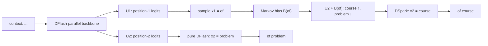

# 从 D-Cut 到 DSpark: 投机解码的下一步不是多猜,而是少验

**日期**: 2026-06-30
**范围**: Qwen3.5-9B DFlash / D-Cut GPU A/B 结果, DeepSeek-AI DeepSpec / DSpark 论文与开源实现
**场景**: vLLM speculative decoding, DFlash 并行 draft, `speculative_tokens=15` 到 adaptive verification 的迁移
**目标**: 给内部论坛/哈桑汇报使用,讲清楚我们已经验证的 D-Cut 价值、DeepSeek DSpark 到底做了什么、以及两者如何合并成下一阶段路线

## 0. 结论先看

先把核心判断放在最前面:

1. **我们内部 D-Cut 已经有真实 GPU A/B 数据**: 在 Qwen3.5-9B + Qwen3.5-9B-DFlash、ALLaVA、`seq=4096/out=128`、每组 256 请求的测试里,D-Cut 在低并发 `c=16` 略慢,但在 `c=32` 时 output tok/s **+27.6%**,在 `c=64` 时 output tok/s **+50.3%**,p50 latency 分别从 `2.74s -> 1.99s`、`4.97s -> 3.21s`。
2. **DeepSeek DSpark 做的是 D-Cut 的训练版与系统版**: 它不是简单“再做一个 draft 模型”,而是把 DFlash 的并行草稿、Markov head 的轻量局部依赖、confidence scheduler 的动态校验预算合到一起。
3. **D-Cut 和 DSpark 是同一条路的两个阶段**: D-Cut 用 heuristic 分数做静态/轻量剪尾;DSpark 用训练出来并校准过的 confidence head 估计 prefix survival,再结合硬件吞吐曲线做 batch-aware 调度。
4. **短期最应该继续推 D-Cut**: 我们已有 DFlash checkpoint,但没有 Qwen3.5 多模态 DSpark checkpoint。完整 DSpark 的 Markov head 和 confidence head 都要训练;D-Cut 不需要训练,且真实 GPU 数据已经说明它的有效区间主要在中高并发。
5. **长期目标是 DSpark 化**: 当 variable verify runtime 稳定后,把 D-Cut 的 heuristic score 替换成 learned confidence,把固定阈值替换成 hardware-aware scheduler,就能自然演进到 DSpark 的生产形态。

一句话:

> **DFlash 解决“便宜地多猜”;D-Cut 解决“不要盲目多验”;DSpark 解决“猜得更连贯,验得更聪明”。**

## 1. 我们自己的 D-Cut 数据先讲清楚

这里的 **D-Cut** 指 DFlash 路径上的 dynamic verification cutting: draft 仍然一次提出完整候选块,但 verifier 只校验更有价值的连续前缀。

先定义符号:

- `K`: draft block size,也就是每轮最多提出的 draft token 数。本次 GPU A/B 里 `K=15`。
- `ell`: 本轮实际送给 verifier 校验的 draft token 数,满足 `0 <= ell <= K`。
- `c`: concurrency,即并发请求数。
- `R_req`: request throughput,单位是 requests/s。
- `R_tok`: output-token throughput,单位是 output tokens/s。
- `TTFT_50`: time-to-first-token 的 p50。
- `L_50`: end-to-end latency 的 p50。
- `M_t`: target model / verifier,即最终输出必须保持一致的主模型。
- `M_d`: draft model / proposer,即 DFlash 这类便宜草稿模型。

本次真实 GPU 测试设置如下:

| 项目 | 设置 |
|---|---|
| Target model `M_t` | Qwen3.5-9B |
| Draft model `M_d` | Qwen3.5-9B-DFlash |
| Dataset | ALLaVA JSONL |
| Speculative method | DFlash |
| Draft block size `K` | 15 |
| Profiling sequence length | 4096 |
| Output tokens per request | 128 |
| Requests per arm / concurrency point | 256 |
| Tested concurrency `c` | 16, 32, 64 |

吞吐增益的计算方式是:

```text
Delta R_tok = (R_tok^D-Cut - R_tok^vanilla) / R_tok^vanilla
```

真实 A/B 结果如下:

| `c` | Vanilla req/s | D-Cut req/s | Req/s delta | Vanilla out tok/s | D-Cut out tok/s | Out tok/s delta | Vanilla TTFT p50 | D-Cut TTFT p50 | Vanilla `L_50` | D-Cut `L_50` |
|---:|---:|---:|---:|---:|---:|---:|---:|---:|---:|---:|
| 16 | 10.02 | 9.73 | -2.9% | 963.7 | 941.2 | -2.3% | 0.13s | 0.13s | 1.58s | 1.54s |
| 32 | 12.41 | 15.99 | +28.8% | 1188.4 | 1516.4 | +27.6% | 0.21s | 0.17s | 2.74s | 1.99s |
| 64 | 12.32 | 18.81 | +52.7% | 1176.9 | 1769.2 | +50.3% | 1.10s | 0.74s | 4.97s | 3.21s |

这个表比抽象的 verify-token reduction 更重要,因为它直接回答了 serving 问题:

1. 在 `c=16` 时,D-Cut 的 controller / D2H / 调度开销还没有被 verifier compute 节省完全摊平,所以 output tok/s 略低 `-2.3%`。
2. 在 `c=32` 时,verifier compute 开始成为主要瓶颈,D-Cut output tok/s 提升 `+27.6%`,p50 latency 从 `2.74s` 降到 `1.99s`。
3. 在 `c=64` 时,高并发把 target verify 压到更满,D-Cut output tok/s 提升 `+50.3%`,p50 latency 从 `4.97s` 降到 `3.21s`,TTFT p50 也从 `1.10s` 降到 `0.74s`。

因此,D-Cut 不是“所有 batch 下都白赚”的优化,而是一个很典型的高并发 serving 优化: 低并发时控制器开销可见,中高并发时 verifier compute 和排队成本占主导,剪掉低价值 verifier 工作才开始变成大收益。

这份结果还有一个工程 caveat: 捕获的 `output_log` 里没有找到完整的 D-Cut activation / profiling 日志行。性能形状已经明显区别于 vanilla DFlash,但下次复跑应保留 `VLLM_LOGGING_LEVEL=INFO`,并在结果里附上:

```text
D-Cut adaptive verify ENABLED
VerifyAdaptiveController: cost table ready
profile  bs=... seq_lens=4096
```

我们之前 DFlash / MTP 报告关注的是“让 draft 更准”。D-Cut 关注的是另一半: **当尾部 token 大概率会被拒,为什么还要让 target 花 batch capacity 去验它?**

## 2. 一个例子: DeepSeek 到底在做什么

先用论文里的 `"of problem"` 例子讲清楚 DSpark。这个例子非常适合解释为什么 DFlash 后缀会崩,以及 Markov head 为什么有效。

假设上下文里有两个合理短语模式:

```text
of course
no problem
```

DFlash 是并行 drafter。它一次前向得到多个位置的 base logits:

- `U_1`: 第 1 个 draft 位置的 base logits,是一个 vocab 维度向量。
- `U_2`: 第 2 个 draft 位置的 base logits。
- `U_3`: 第 3 个 draft 位置的 base logits。
- `x_k`: 第 `k` 个 draft token,从第 `k` 个位置的分布里采样或 greedy 取出。

纯 DFlash 可以写成:

```text
x_1 ~ softmax(U_1)
x_2 ~ softmax(U_2)
x_3 ~ softmax(U_3)
```

问题是 `U_2` 计算时不知道 `x_1` 最后实际采成什么。于是第 1 位可能选择 `of`,第 2 位却仍从另一个模式里选择 `problem`,组合成:

```text
of problem
```

单看 `of` 合理,单看 `problem` 也合理,但连起来不合理。投机解码只接受连续前缀,所以这种后缀不连贯会快速拉低 accepted length。

DSpark 的 Markov head 做了一件很小但很聪明的事: 等 `x_1` 采出来后,不重跑 transformer,只给 `U_2` 加一个由 `x_1` 决定的 transition bias:

```text
DFlash:  x_2 ~ softmax(U_2)
DSpark:  x_2 ~ softmax(U_2 + B(x_1))
```

这里 `B(x_1)` 是前一个 token 对下一个 token vocab logits 的修正项。比如 `x_1 = of` 时,`B(of)` 会提高 `course` 的 logit,压低 `problem` 的 logit,于是结果变成:

```text
of course
```

图上看就是这样:



这个例子的重点不是英语短语,而是一个普遍现象: **并行预测会混合多个 mode 的边缘分布,轻量局部条件能把 mode 对齐回来。**

## 3. 数学形式: speculative decoding 的三个杠杆

我们把一轮 speculative decoding 写成:

- `K`: draft block size。
- `x_{1:K}`: draft tokens,即 `(x_1, x_2, ..., x_K)`。
- `p^d_k(v)`: draft model 在第 `k` 个位置给 token `v` 的概率。
- `p^t_k(v)`: target model 在第 `k` 个位置给 token `v` 的概率。
- `tau`: 一轮实际接受的 draft token 数。
- `T_draft`: draft 阶段耗时。
- `T_verify`: verifier 阶段耗时。

投机解码的每 token 延迟可以粗略写成:

```text
L = (T_draft + T_verify) / (tau + 1)
```

这里 `+1` 是 target 在 rejection sampling 后补出来的 bonus token。很多 vLLM metric 里 `spec_mean_accepted_tokens_per_draft` 只统计被接受的 draft token,不含 bonus;如果要看真实每轮吐出的 token 数,要用 `tau + 1`。

因此加速有三条路:

1. 降低 `T_draft`: DFlash 的并行 draft 就是在做这件事。
2. 提高 `tau`: MTP 微调、DFlash 自蒸馏、DSpark Markov head 都是在做这件事。
3. 降低有效 `T_verify`: D-Cut 和 DSpark confidence scheduler 做的是这件事。

过去我们主要做第 2 件事: 让 draft 接受率更高。现在 D-Cut/DSpark 关注第 3 件事: **不要把 target verify 浪费在大概率会被拒的尾巴上。**

## 4. Markov Head: 用极小串行成本修 DFlash 后缀

DSpark 把 draft 分成两个阶段。

第一阶段是 parallel backbone。它一次性产生:

```text
U_1, U_2, ..., U_K
```

其中 `U_k in R^{|V|}` 是第 `k` 个位置的 base logits,`|V|` 是 vocabulary size。

第二阶段是 lightweight sequential head。它把块内分布写成半自回归形式:

```text
P(x_{1:K} | x_0)
  = product_{k=1}^{K} p_k(x_k | x_0, x_{<k})

p_k(v | x_0, x_{<k})
  = softmax(U_k(v) + B_k(x_0, x_{<k}, v))
```

这里:

- `x_0`: anchor token,即上一轮 target 产生的 token,也是本轮 draft 的起点。
- `x_{<k}`: 当前块内第 `k` 位之前已经采样出来的 draft prefix。
- `B_k(...)`: sequential head 产生的 logit bias。

默认 Markov head 只看前一个 token:

```text
B_k(x_0, x_{<k}, v) = B(x_{k-1}, v)
```

如果直接存一个完整 `|V| x |V|` 的 transition matrix 太大,所以 DSpark 用低秩分解:

```text
B(prev, .) = W_1[prev] W_2
```

其中:

- `W_1 in R^{|V| x r}`: token embedding lookup table。
- `W_2 in R^{r x |V|}`: logit projection。
- `r`: Markov rank,DeepSpec 默认 `r=256`。

所以每一步只需要:

```text
prev token id -> W_1 lookup -> small vector -> W_2 projection -> logits bias
```

这比重新跑一遍 transformer 便宜得多。论文里也验证了这个头开销很小: batch=128 时,proposal length 从 4 增到 16,相对 DFlash 的整轮 latency 只增加约 0.2% 到 1.3%,但 accepted length 最多提升到 +30% 级别。

## 5. Confidence Scheduler: D-Cut 的满血形态

D-Cut 和 DSpark scheduler 都建立在同一个事实上: speculative decoding 只接受连续前缀。

定义:

- `c_k`: 条件接受概率,表示“在 `x_1,...,x_{k-1}` 都已被接受的条件下,第 `k` 位继续被接受的概率”。
- `a_j`: prefix survival probability,表示前 `j` 个 draft token 全部被接受的概率。

于是:

```text
a_j = product_{k=1}^{j} c_k
```

如果 `a_j` 很低,第 `j` 位以及后面的 token 大概率不会进入输出,继续校验它们就是浪费 verifier batch capacity。

DSpark 的 confidence head 训练目标来自 draft 分布和 target 分布的 total variation distance:

```text
c*_k = 1 - 1/2 || p^d_k - p^t_k ||_1
```

其中:

- `c*_k`: 第 `k` 位条件接受概率的 soft label。
- `||.||_1`: L1 distance。
- `p^d_k`: draft distribution。
- `p^t_k`: target distribution。

这个公式不是经验拍脑袋。标准 speculative decoding 的单步接受概率和 draft/target 分布距离直接相关;draft 越接近 target,这个值越接近 1。

有了 `a_j` 之后,最简单的剪尾就是静态阈值:

```text
keep prefix length ell = max j such that a_j >= threshold
```

这就是 D-Cut 的 MVP 版。我们内部先跑通的也是这个方向: 不训练新头,先用 DFlash 已有的 per-position draft probability / margin / entropy 这类 heuristic 构造一个 survival proxy,把固定 `ell=K` 变成动态 `ell<=K`。

DSpark 的满血版再进一步: 它不仅看 token 是否可靠,还看当前硬件负载下“多验这个 token 值不值”。

定义:

- `R`: 当前 batch 里的 active request 数。
- `ell_r`: 第 `r` 条请求要校验的 draft prefix 长度。
- `B = sum_{r=1}^{R} (1 + ell_r)`: 本轮 target verify 的总 query token 数,每条请求至少有 1 个 anchor/bonus 相关 token。
- `SPS(B)`: engine 在 query token batch size 为 `B` 时的 steps per second,由硬件 profiling 得到。
- `Theta`: 预计系统吞吐。

DSpark scheduler 的目标是:

```text
Theta = expected_accepted_tokens * SPS(B)
```

把每条请求每个位置的 `a_{r,j}` 看成一个“继续多验一个 token 的边际收益”,全 batch 排序,优先把最高收益的 prefix token 放进 verifier。这样:

- 轻载时: `SPS(B)` 下降不明显,可以多验一些,换更高用户侧速度。
- 重载时: `SPS(B)` 对 batch size 更敏感,低置信尾巴会被剪掉,避免挤占其他请求。

这就是为什么我说 **DSpark scheduler 是 D-Cut 的训练版、校准版、硬件感知版**。

## 6. 为什么这个设计保持 lossless

投机解码的无损性来自 rejection sampling。第 `k` 位 draft token `x_k` 的接受概率是:

```text
alpha_k = min(1, p^t_k(x_k) / p^d_k(x_k))
```

其中:

- `alpha_k`: 第 `k` 位的 rejection sampling 接受概率。
- `p^d_k(x_k)`: 实际 draft sampling distribution 给 `x_k` 的概率。
- `p^t_k(x_k)`: target distribution 给 `x_k` 的概率。

D-Cut / DSpark scheduler 只决定提交多长前缀:

```text
submit x_{1:ell}, drop x_{ell+1:K}
```

它不改变已提交 token 的接受规则。因此只要满足两个条件,输出分布仍然等价于原 target:

1. `p^d_k` 必须和实际采样 `x_k` 的 draft distribution 一致。
2. `ell` 的决定不能偷看会破坏因果性的未来信息。

第二点非常关键。DSpark 论文把它叫 **non-anticipating property**。如果 scheduler 用未来 token 的信息反过来决定当前 token 是否进入 verifier,会产生 selection bias。

我们的 D-Cut MVP 更容易守住这个约束: 它只做连续前缀裁剪,不改 rejection sampler。后续如果合入 Markov head,还要特别注意第一点: 采样用了 `U_k + B(x_{k-1})`,则 acceptance 里的 `p^d_k` 也必须来自 `softmax(U_k + B(x_{k-1}))`,不能再用原始 `softmax(U_k)`。

## 7. DeepSpec 仓库给了什么

DeepSpec 是 DeepSeek 开源的投机解码训练/评测仓,包含 Eagle3、DFlash、DSpark 三套算法。公开 checkpoint 覆盖:

| Algorithm | Qwen3-4B | Qwen3-8B | Qwen3-14B | Gemma4-12B-it |
|---|---|---|---|---|
| Eagle3 | 有 | 有 | 有 | 有 |
| DFlash | 有 | 有 | 有 | 有 |
| DSpark | 有 | 有 | 有 | 有 |

注意: 这里没有我们要的 Qwen3.5 多模态 / Qwen3.5-122B-A10B checkpoint。所以对我们来说,DeepSpec 更像训练与实现参考,不能直接拿来替换上线。

DeepSpec 配置里,DFlash 和 DSpark 的关系很直接:

| 配置项 | DFlash | DSpark |
|---|---|---|
| block size | 7 | 7 |
| draft layers | 5 | 5 |
| target features | 多层 hidden states | 多层 hidden states |
| Markov head | `markov_rank=0` 关闭 | `markov_rank=256` 开启 |
| confidence head | `confidence_head_alpha=0.0` 关闭 | `confidence_head_alpha=1.0` 开启 |
| loss | CE-only | CE + TV/L1 distribution matching + confidence BCE |

换句话说,DeepSpec 的 DFlash 是 DSpark 的退化版: 关掉 Markov 和 confidence,就是纯并行 DFlash。

## 8. 论文结果: DSpark 相对 DFlash 的收益

离线 benchmark 上,论文关闭 scheduler,只比较 raw draft quality。DSpark 相对 DFlash 的 accepted length 提升:

| Target | 相对 DFlash accepted length |
|---|---:|
| Qwen3-4B | +16.3% |
| Qwen3-8B | +18.4% |
| Qwen3-14B | +18.3% |

相对 Eagle3 的提升更大:

| Target | 相对 Eagle3 accepted length |
|---|---:|
| Qwen3-4B | +30.9% |
| Qwen3-8B | +26.7% |
| Qwen3-14B | +30.0% |

线上 production 部署里,DeepSeek 把 DSpark-5 用在 DeepSeek-V4-Flash / V4-Pro preview,相对之前的 MTP-1 baseline:

| 场景 | 结论 |
|---|---|
| V4-Flash 中等 SLA | aggregate throughput +51% |
| V4-Pro 中等 SLA | aggregate throughput +52% |
| matched throughput | V4-Flash 单用户生成速度 +60% 到 +85% |
| matched throughput | V4-Pro 单用户生成速度 +57% 到 +78% |

这些结果和我们的 D-Cut GPU A/B 是同向的: 高并发时,收益不只来自 draft 接受率,还来自避免 verifier 校验低价值尾巴。我们的 Qwen3.5-9B 测试里,D-Cut 在 `c=32/64` 分别带来 `+27.6%/+50.3%` output tok/s,也正好说明 verifier-side budget 在中高并发下足够关键。

## 9. 和我们当前工作的对应关系

| 方案 | 是否需要训练 | 做了什么 | 我们当前状态 | 下一步 |
|---|---|---|---|---|
| DFlash 自蒸馏 | 需要 | 提高 draft 接受率 | 已在 9B/122B 多模态验证 | 保留为底座 |
| MTP 微调 + soup | 需要 | 提高原生 MTP 接受率 | 已验证,122B 当前最强 | 继续用于 MTP 主线 |
| D-Cut MVP | 不需要 | 固定 draft block,动态减少 `ell` | Qwen3.5-9B GPU A/B: `c=32` output tok/s +27.6%,`c=64` +50.3%;`c=16` -2.3%;vLLM 插件分支已在 `Bensong0506/vllm:feat/dcut-adaptive-verify` | 补齐 activation/profiling 日志,迁 NPU |
| DSpark Markov | 需要 | `U_k + B(x_{k-1})` 修后缀 | 尚无 Qwen3.5 多模态权重 | 训练小模型头做 A/B |
| DSpark confidence | 需要+校准 | 预测 `c_k` / `a_j` | 尚未训练 | 替换 D-Cut heuristic |
| Hardware scheduler | 需要 runtime | 用 `Theta = expected_accepts * SPS(B)` 分配 verify budget | D-Cut 分支已有 controller/profiling 雏形 | 与 continuous batching / NPU runner 对齐 |

这里最值得强调的是: **我们不应该等完整 DSpark 训练完才做 serving 链路**。D-Cut 已经在真实 GPU A/B 里证明了中高并发收益;而 DSpark 最终也依赖同一条 variable verify path。

## 10. 合入路线

### Phase A: D-Cut 继续做成生产可测版本

目标: 用现有 DFlash checkpoint,不训练新模型,把 variable verify path 跑稳。

关键动作:

1. DFlash proposer 继续输出完整 draft block;当前 GPU A/B 使用 `K=15`。
2. 记录每个位置的 draft confidence proxy,例如 selected probability、margin、entropy、position decay。
3. D-Cut controller 选择 `ell`。
4. verifier 只接收 `x_{1:ell}`。
5. rejection sampler 保持不变。

需要汇报的指标:

| 指标 | 含义 |
|---|---|
| `bar{ell}` | 平均 verifier 校验深度;本次 GPU 表暂未捕获,下次应从 controller log 补齐 |
| verify token reduction | `(K - bar{ell}) / K`;只在 `bar{ell}` 被真实记录后汇报 |
| `tau` | 平均接受 draft token 数 |
| `tau + 1` | 真实每轮输出 token 数,含 bonus |
| output tok/s | 端到端输出吞吐 |
| TTFT / TPOT | 用户侧首 token / 每 token 延迟 |
| wasted verify tokens | 校验但最终不会贡献输出的尾部 token |
| activation log | 是否出现 `D-Cut adaptive verify ENABLED` 与 cost-table profiling 行 |

第一版结论应该按 concurrency 分层看,不能只看单请求:

- `concurrency=16`: 本次 GPU A/B output tok/s `-2.3%`,说明低并发下控制器开销还可见。
- `concurrency=32`: output tok/s `+27.6%`,p50 latency `2.74s -> 1.99s`。
- `concurrency=64`: output tok/s `+50.3%`,p50 latency `4.97s -> 3.21s`,是当前最强证据点。

### Phase B: 训练 Markov head

目标: 把 DFlash 的后缀从“独立边缘分布”修成“轻量条件分布”。

训练后推理必须做到:

```text
sample: x_k ~ softmax(U_k + B(x_{k-1}))
verify: p^d_k = softmax(U_k + B(x_{k-1}))
```

这一步的 A/B 指标重点不是总吞吐,而是 position-wise conditional acceptance:

```text
cond_acc_k = P(x_k accepted | x_1,...,x_{k-1} accepted)
```

如果 Markov head 有效,应该主要看到中后位 `cond_acc_k` 上升,尤其是自然语言短语、代码局部结构、标点和模板位置。

### Phase C: 训练 confidence head,替换 D-Cut heuristic

目标: 不再用 heuristic proxy 判断 `ell`,而是预测条件接受概率:

```text
c_k = P(x_k accepted | x_{<k} accepted)
a_j = product_{k=1}^{j} c_k
```

训练标签:

```text
c*_k = 1 - 1/2 ||p^d_k - p^t_k||_1
```

上线前必须做 calibration:

- per-position ECE。
- AUROC。
- Brier score。
- cumulative survival reliability。

confidence 没校准好时,静态阈值还能勉强用,hardware-aware scheduler 会被绝对概率误导。所以校准不是锦上添花,是调度器必要条件。

### Phase D: Hardware-aware scheduler

目标: 从“单请求剪尾”升级到“全 batch 分配 verifier budget”。

形式上就是:

```text
maximize Theta = expected_accepted_tokens * SPS(B)
```

工程上要解决:

1. profiling 出 NPU/GPU 上的 `SPS(B)` 或等价 cost table。
2. continuous batching 下 active requests 动态进出。
3. 每条请求不同 `ell_r` 的 metadata 表达。
4. runner 组装变长 verify batch。
5. scheduler 的 non-anticipating 正确性。

这一步做完,D-Cut 才真正变成 DSpark scheduler。

## 11. 需要避免的误解

**误解 1: D-Cut 可以用于 MTP。**
当前 D-Cut 路径只适合 DFlash/PARD 这类 parallel drafter。原因是它需要一次拿到整块 per-position probability,然后剪 verifier 宽度。MTP 是自回归 draft,成本主要在 draft 侧,更适合做 draft-side early stop,不是这套 D-Cut。

**误解 2: D-Cut 在任何并发下都会提升吞吐。**
不成立。真实 GPU A/B 里 `c=16` output tok/s 是 `-2.3%`,因为 controller / D2H / 调度开销还没有被 verifier compute 节省摊平。D-Cut 的有效区间从 `c=32` 开始明显出现,到 `c=64` 时 output tok/s 达到 `+50.3%`。

**误解 3: DSpark 不需要训练。**
完整 DSpark 需要训练 Markov head 和 confidence head。我们现在能无需训练先做的是 D-Cut MVP。

**误解 4: 剪尾会改变输出。**
只要剪的是连续后缀,且已提交 token 仍走标准 rejection sampling,输出分布仍然是 target model 的分布。剪尾只是少给 verifier 一些本来也很可能被拒的候选,不是改 target 采样规则。

## 12. 一句话收束

我们已经用 DFlash/MTP 证明了“draft 猜得更准”能带来收益;D-Cut 的 Qwen3.5-9B GPU A/B 进一步说明,在 `seq4096/out128` 这类长上下文高并发负载下,少验低价值尾巴可以在 `c=32` 带来 `+27.6%` output tok/s,在 `c=64` 带来 `+50.3%` output tok/s。DeepSeek DSpark 把这条路系统化: 用 Markov head 让 DFlash 后缀更连贯,用 confidence head 预测 prefix survival,再用 hardware-aware scheduler 把 verifier budget 分给最值得验的 token。

所以我们的路线应该是:

```text
DFlash checkpoint
  -> D-Cut MVP: heuristic, no training, variable verify path
  -> Markov head: trainable local dependency
  -> confidence head: learned prefix survival
  -> hardware-aware scheduler: DSpark-style serving
```

短期继续把 D-Cut 在 vLLM/NPU 上跑实,并补齐 activation / profiling 日志;中期训练 Qwen3.5 多模态 DSpark heads;长期把 D-Cut 的 heuristic controller 替换成 DSpark 的 learned confidence scheduler。

## 参考

- 内部 D-Cut vLLM 分支: `Bensong0506/vllm:feat/dcut-adaptive-verify`
- 内部 D-Cut GPU A/B 结果: `reports/D-cut`
- 内部 DFlash/MTP 系列报告: `reports/dflash_mtp_internal_community_report.md`
- DeepSpec GitHub: https://github.com/deepseek-ai/DeepSpec
- DSpark paper: `DSpark_paper.pdf`
- DeepSpec implementation: `deepspec/modeling/dspark/markov_head.py`, `deepspec/eval/dspark/draft_ops.py`, `deepspec/modeling/dspark/loss.py`
