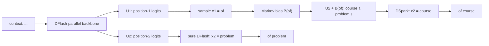

# DeepSeek DSpark 之后: 我们该拿走什么

**日期**: 2026-06-30
**范围**: Qwen3.5-9B DFlash / D-Cut GPU A/B 结果, DeepSeek-AI DeepSpec / DSpark 论文与开源实现
**场景**: vLLM speculative decoding, DFlash 并行 draft, `speculative_tokens=15` 到 adaptive verification 的迁移
**目标**: 给内部论坛/哈桑汇报使用,讲清楚我们已经验证的 D-Cut 价值、DeepSeek DSpark 到底做了什么、以及两者如何合并成下一阶段路线

DeepSeek 最近放出了 DeepSpec / DSpark,这不是又一个普通的 draft model repo。它传递出来的信号更像是: 投机推理已经从“多猜几个 token”进入到“怎么让这些 token 更连贯、怎么让 verifier 只验值得验的部分”的新阶段。

所以我们要问的问题不是“要不要照搬 DSpark”,而是: **哪些东西今天就能为我们的 Qwen3.5 多模态 DFlash 服务,哪些东西需要训练以后再合入,哪些 serving 链路应该先铺好。**

## 0. 先看结果: Vanilla vs D-Cut

这里的 **Vanilla** 指不开 D-Cut 的 DFlash baseline: target、draft、数据集、`speculative_tokens=15` 都相同,只是 verifier 仍按原始 DFlash 路径校验候选块,不做 adaptive verification cutting。

测试设置: Qwen3.5-9B + Qwen3.5-9B-DFlash,ALLaVA,`seq=4096/out=128`,每个并发点每组 256 请求。

| concurrency | Vanilla req/s | D-Cut req/s | Vanilla out tok/s | D-Cut out tok/s | out tok/s delta | p50 latency |
|---:|---:|---:|---:|---:|---:|---|
| 16 | 10.02 | 9.73 | 963.7 | 941.2 | -2.3% | 1.58s -> 1.54s |
| 32 | 12.41 | 15.99 | 1188.4 | 1516.4 | +27.6% | 2.74s -> 1.99s |
| 64 | 12.32 | 18.81 | 1176.9 | 1769.2 | +50.3% | 4.97s -> 3.21s |

一句话: D-Cut 不是低并发白赚的优化,但一到 `c=32/64`,verifier 成为主要瓶颈以后,少验低价值尾巴就开始直接换吞吐和延迟。

## 1. DeepSeek 这次真正提醒了我们什么

过去我们做 DFlash / MTP,核心努力是让 draft 更准: draft 猜得越接近 target,accepted length 越长,系统就越快。DeepSeek 的 DSpark 没有否定这条路,而是把它往前推了一步: **draft 不仅要多猜,还要猜得连贯;verifier 不仅要验,还要把预算花在最可能被接受的 token 上。**

把 DSpark 拆开看,它给了三件可以落地的东西:

1. **Markov head**: 给 DFlash 的并行后缀补一点轻量局部依赖,解决 `"of problem"` 这种 mode-mixing 问题。
2. **confidence head**: 预测每个 draft 位置继续被接受的概率,把“该验多长”从 heuristic 变成 learned probability。
3. **hardware-aware scheduler**: 不只看 token 置信度,还看当前 GPU/NPU batch shape 下多验一个 token 值不值。

这和我们的 D-Cut 不是两条线。D-Cut 是这条路线的第一块拼图: 不训练新模型,先把 serving 链路从“固定验满”改成“动态剪尾”。等这条 variable verify path 稳了,后面才能自然接 Markov head、confidence head 和 scheduler。

## 2. 我们自己的 D-Cut GPU 结果怎么读

这里的 **D-Cut** 指 DFlash 路径上的 dynamic verification cutting: draft 仍然一次提出完整候选块,但 verifier 只校验更有价值的连续前缀。

先定义符号:

- `K`: draft block size,也就是每轮最多提出的 draft token 数。本次 GPU A/B 里 `K=15`。
- `ell`: 本轮实际送给 verifier 校验的 draft token 数,满足 `0 <= ell <= K`。
- `c`: concurrency,即并发请求数。
- `R_req`: request throughput,单位是 requests/s。
- `R_tok`: output-token throughput,单位是 output tokens/s。
- `TTFT_50`: time-to-first-token 的 p50。
- `L_50`: end-to-end latency 的 p50。
- `M_t`: target model / verifier,即最终输出必须保持一致的主模型。
- `M_d`: draft model / proposer,即 DFlash 这类便宜草稿模型。

本次真实 GPU 测试设置如下:

| 项目 | 设置 |
|---|---|
| Target model `M_t` | Qwen3.5-9B |
| Draft model `M_d` | Qwen3.5-9B-DFlash |
| Dataset | ALLaVA JSONL |
| Speculative method | DFlash |
| Draft block size `K` | 15 |
| Profiling sequence length | 4096 |
| Output tokens per request | 128 |
| Requests per arm / concurrency point | 256 |
| Tested concurrency `c` | 16, 32, 64 |

吞吐增益的计算方式是:

$$
\Delta R_{\mathrm{tok}}
=
\frac{
R_{\mathrm{tok}}^{\mathrm{D\text{-}Cut}}
-
R_{\mathrm{tok}}^{\mathrm{Vanilla}}
}{
R_{\mathrm{tok}}^{\mathrm{Vanilla}}
}.
$$

完整 A/B 表如下:

| `c` | Vanilla req/s | D-Cut req/s | Req/s delta | Vanilla out tok/s | D-Cut out tok/s | Out tok/s delta | Vanilla TTFT p50 | D-Cut TTFT p50 | Vanilla `L_50` | D-Cut `L_50` |
|---:|---:|---:|---:|---:|---:|---:|---:|---:|---:|---:|
| 16 | 10.02 | 9.73 | -2.9% | 963.7 | 941.2 | -2.3% | 0.13s | 0.13s | 1.58s | 1.54s |
| 32 | 12.41 | 15.99 | +28.8% | 1188.4 | 1516.4 | +27.6% | 0.21s | 0.17s | 2.74s | 1.99s |
| 64 | 12.32 | 18.81 | +52.7% | 1176.9 | 1769.2 | +50.3% | 1.10s | 0.74s | 4.97s | 3.21s |

这个表比抽象的 verify-token reduction 更重要,因为它直接回答了 serving 问题:

1. 在 `c=16` 时,D-Cut 的 controller / D2H / 调度开销还没有被 verifier compute 节省完全摊平,所以 output tok/s 略低 `-2.3%`。
2. 在 `c=32` 时,verifier compute 开始成为主要瓶颈,D-Cut output tok/s 提升 `+27.6%`,p50 latency 从 `2.74s` 降到 `1.99s`。
3. 在 `c=64` 时,高并发把 target verify 压到更满,D-Cut output tok/s 提升 `+50.3%`,p50 latency 从 `4.97s` 降到 `3.21s`,TTFT p50 也从 `1.10s` 降到 `0.74s`。

因此,D-Cut 不是“所有 batch 下都白赚”的优化,而是一个很典型的高并发 serving 优化: 低并发时控制器开销可见,中高并发时 verifier compute 和排队成本占主导,剪掉低价值 verifier 工作才开始变成大收益。

这份结果还有一个工程 caveat: 捕获的 `output_log` 里没有找到完整的 D-Cut activation / profiling 日志行。性能形状已经明显区别于 vanilla DFlash,但下次复跑应保留 `VLLM_LOGGING_LEVEL=INFO`,并在结果里附上:

```text
D-Cut adaptive verify ENABLED
VerifyAdaptiveController: cost table ready
profile  bs=... seq_lens=4096
```

我们之前 DFlash / MTP 报告关注的是“让 draft 更准”。D-Cut 关注的是另一半: **当尾部 token 大概率会被拒,为什么还要让 target 花 batch capacity 去验它?**

## 3. 一个例子: DeepSeek 到底在做什么

先用论文里的 `"of problem"` 例子讲清楚 DSpark。这个例子非常适合解释为什么 DFlash 后缀会崩,以及 Markov head 为什么有效。

假设上下文里有两个合理短语模式:

```text
of course
no problem
```

DFlash 是并行 drafter。它一次前向得到多个位置的 base logits:

- `U_1`: 第 1 个 draft 位置的 base logits,是一个 vocab 维度向量。
- `U_2`: 第 2 个 draft 位置的 base logits。
- `U_3`: 第 3 个 draft 位置的 base logits。
- `x_k`: 第 `k` 个 draft token,从第 `k` 个位置的分布里采样或 greedy 取出。

纯 DFlash 可以写成:

$$
x_1 \sim \mathrm{softmax}(U_1),\qquad
x_2 \sim \mathrm{softmax}(U_2),\qquad
x_3 \sim \mathrm{softmax}(U_3).
$$

问题是 `U_2` 计算时不知道 `x_1` 最后实际采成什么。于是第 1 位可能选择 `of`,第 2 位却仍从另一个模式里选择 `problem`,组合成:

```text
of problem
```

单看 `of` 合理,单看 `problem` 也合理,但连起来不合理。投机解码只接受连续前缀,所以这种后缀不连贯会快速拉低 accepted length。

DSpark 的 Markov head 做了一件很小但很聪明的事: 等 `x_1` 采出来后,不重跑 transformer,只给 `U_2` 加一个由 `x_1` 决定的 transition bias:

$$
x_2^{\mathrm{DFlash}} \sim \mathrm{softmax}(U_2),
\qquad
x_2^{\mathrm{DSpark}} \sim \mathrm{softmax}\!\left(U_2 + B(x_1)\right).
$$

这里 `B(x_1)` 是前一个 token 对下一个 token vocab logits 的修正项。比如 `x_1 = of` 时,`B(of)` 会提高 `course` 的 logit,压低 `problem` 的 logit,于是结果变成:

```text
of course
```

图上看就是这样:



这个例子的重点不是英语短语,而是一个普遍现象: **并行预测会混合多个 mode 的边缘分布,轻量局部条件能把 mode 对齐回来。**

## 4. 数学形式: speculative decoding 的三个杠杆

我们把一轮 speculative decoding 写成:

- `K`: draft block size。
- `x_{1:K}`: draft tokens,即 `(x_1, x_2, ..., x_K)`。
- `p^d_k(v)`: draft model 在第 `k` 个位置给 token `v` 的概率。
- `p^t_k(v)`: target model 在第 `k` 个位置给 token `v` 的概率。
- `tau`: 一轮实际接受的 draft token 数。
- `T_draft`: draft 阶段耗时。
- `T_verify`: verifier 阶段耗时。

投机解码的每 token 延迟可以粗略写成:

$$
L
=
\frac{T_{\mathrm{draft}} + T_{\mathrm{verify}}}{\tau + 1}.
$$

这里 `+1` 是 target 在 rejection sampling 后补出来的 bonus token。很多 vLLM metric 里 `spec_mean_accepted_tokens_per_draft` 只统计被接受的 draft token,不含 bonus;如果要看真实每轮吐出的 token 数,要用 `tau + 1`。

因此加速有三条路:

1. 降低 `T_draft`: DFlash 的并行 draft 就是在做这件事。
2. 提高 `tau`: MTP 微调、DFlash 自蒸馏、DSpark Markov head 都是在做这件事。
3. 降低有效 `T_verify`: D-Cut 和 DSpark confidence scheduler 做的是这件事。

过去我们主要做第 2 件事: 让 draft 接受率更高。现在 D-Cut/DSpark 关注第 3 件事: **不要把 target verify 浪费在大概率会被拒的尾巴上。**

## 5. Markov Head: 用极小串行成本修 DFlash 后缀

DSpark 把 draft 分成两个阶段。

第一阶段是 parallel backbone。它一次性产生:

$$
U_1,\; U_2,\; \ldots,\; U_K.
$$

其中 $U_k \in \mathbb{R}^{|\mathcal{V}|}$ 是第 `k` 个位置的 base logits,$|\mathcal{V}|$ 是 vocabulary size。

第二阶段是 lightweight sequential head。它把块内分布写成半自回归形式:

$$
\begin{aligned}
P(x_{1:K}\mid x_0)
&=
\prod_{k=1}^{K}
p_k(x_k\mid x_0, x_{<k}),\\
p_k(v\mid x_0, x_{<k})
&=
\frac{
\exp\!\left(U_k(v) + B_k(x_0, x_{<k}, v)\right)
}{
\sum_{v'\in\mathcal{V}}
\exp\!\left(U_k(v') + B_k(x_0, x_{<k}, v')\right)
}.
\end{aligned}
$$

这里:

- `x_0`: anchor token,即上一轮 target 产生的 token,也是本轮 draft 的起点。
- `x_{<k}`: 当前块内第 `k` 位之前已经采样出来的 draft prefix。
- `B_k(...)`: sequential head 产生的 logit bias。

默认 Markov head 只看前一个 token:

$$
B_k(x_0, x_{<k}, v)
=
B(x_{k-1}, v).
$$

如果直接存一个完整 `|V| x |V|` 的 transition matrix 太大,所以 DSpark 用低秩分解:

$$
B(\mathrm{prev}, :)
=
W_1[\mathrm{prev}]\,W_2.
$$

其中:

- $W_1 \in \mathbb{R}^{|\mathcal{V}|\times r}$: token embedding lookup table。
- $W_2 \in \mathbb{R}^{r\times |\mathcal{V}|}$: logit projection。
- `r`: Markov rank,DeepSpec 默认 `r=256`。

所以每一步只需要:

```text
prev token id -> W_1 lookup -> small vector -> W_2 projection -> logits bias
```

这比重新跑一遍 transformer 便宜得多。论文里也验证了这个头开销很小: batch=128 时,proposal length 从 4 增到 16,相对 DFlash 的整轮 latency 只增加约 0.2% 到 1.3%,但 accepted length 最多提升到 +30% 级别。

## 6. Confidence Scheduler: D-Cut 的满血形态

D-Cut 和 DSpark scheduler 都建立在同一个事实上: speculative decoding 只接受连续前缀。

定义:

- `c_k`: 条件接受概率,表示“在 `x_1,...,x_{k-1}` 都已被接受的条件下,第 `k` 位继续被接受的概率”。
- `a_j`: prefix survival probability,表示前 `j` 个 draft token 全部被接受的概率。

于是:

$$
a_j
=
\prod_{k=1}^{j} c_k.
$$

如果 `a_j` 很低,第 `j` 位以及后面的 token 大概率不会进入输出,继续校验它们就是浪费 verifier batch capacity。

DSpark 的 confidence head 训练目标来自 draft 分布和 target 分布的 total variation distance:

$$
c_k^{*}
=
1
-
\frac{1}{2}
\left\|
p_k^{d} - p_k^{t}
\right\|_1.
$$

其中:

- $c_k^*$: 第 `k` 位条件接受概率的 soft label。
- $\|\cdot\|_1$: L1 distance。
- $p_k^d$: draft distribution。
- $p_k^t$: target distribution。

这个公式不是经验拍脑袋。标准 speculative decoding 的单步接受概率和 draft/target 分布距离直接相关;draft 越接近 target,这个值越接近 1。

有了 `a_j` 之后,最简单的剪尾就是静态阈值:

$$
\ell
=
\max
\left\{
j \;:\; a_j \ge \theta
\right\}.
$$

这就是 D-Cut 的 MVP 版。我们内部先跑通的也是这个方向: 不训练新头,先用 DFlash 已有的 per-position draft probability / margin / entropy 这类 heuristic 构造一个 survival proxy,把固定 `ell=K` 变成动态 `ell<=K`。

DSpark 的满血版再进一步: 它不仅看 token 是否可靠,还看当前硬件负载下“多验这个 token 值不值”。

定义:

- `R`: 当前 batch 里的 active request 数。
- `ell_r`: 第 `r` 条请求要校验的 draft prefix 长度。
- $B=\sum_{r=1}^{R}(1+\ell_r)$: 本轮 target verify 的总 query token 数,每条请求至少有 1 个 anchor/bonus 相关 token。
- `SPS(B)`: engine 在 query token batch size 为 `B` 时的 steps per second,由硬件 profiling 得到。
- $A_{\mathrm{acc}}(B)$: 在 batch size 为 $B$ 时的 accepted token 数估计量。
- $\Theta(B)$: 预计系统吞吐。

DSpark scheduler 的目标是:

$$
\Theta(B)
=
\mathbb{E}\!\left[A_{\mathrm{acc}}(B)\right]
\cdot
\mathrm{SPS}(B).
$$

把每条请求每个位置的 `a_{r,j}` 看成一个“继续多验一个 token 的边际收益”,全 batch 排序,优先把最高收益的 prefix token 放进 verifier。这样:

- 轻载时: `SPS(B)` 下降不明显,可以多验一些,换更高用户侧速度。
- 重载时: `SPS(B)` 对 batch size 更敏感,低置信尾巴会被剪掉,避免挤占其他请求。

这就是为什么我说 **DSpark scheduler 是 D-Cut 的训练版、校准版、硬件感知版**。

## 7. 为什么这个设计保持 lossless

投机解码的无损性来自 rejection sampling。第 `k` 位 draft token `x_k` 的接受概率是:

$$
\alpha_k
=
\min
\left(
1,\;
\frac{p_k^{t}(x_k)}{p_k^{d}(x_k)}
\right).
$$

其中:

- $\alpha_k$: 第 `k` 位的 rejection sampling 接受概率。
- $p_k^d(x_k)$: 实际 draft sampling distribution 给 `x_k` 的概率。
- $p_k^t(x_k)$: target distribution 给 `x_k` 的概率。

D-Cut / DSpark scheduler 只决定提交多长前缀:

$$
\mathrm{submit}\;x_{1:\ell},
\qquad
\mathrm{drop}\;x_{\ell+1:K}.
$$

它不改变已提交 token 的接受规则。因此只要满足两个条件,输出分布仍然等价于原 target:

1. `p^d_k` 必须和实际采样 `x_k` 的 draft distribution 一致。
2. `ell` 的决定不能偷看会破坏因果性的未来信息。

第二点非常关键。DSpark 论文把它叫 **non-anticipating property**。如果 scheduler 用未来 token 的信息反过来决定当前 token 是否进入 verifier,会产生 selection bias。

我们的 D-Cut MVP 更容易守住这个约束: 它只做连续前缀裁剪,不改 rejection sampler。后续如果合入 Markov head,还要特别注意第一点: 采样用了 `U_k + B(x_{k-1})`,则 acceptance 里的 `p^d_k` 也必须来自 `softmax(U_k + B(x_{k-1}))`,不能再用原始 `softmax(U_k)`。

## 13. 一句话收束

DeepSeek DSpark 给我们的启发不是立刻照搬一个新模型,而是把投机推理拆成三件可以逐步合入的事: 先用 D-Cut 在真实高并发 GPU 负载下证明“少验低价值尾巴”能把 output tok/s 从 `c=32` 的 `+27.6%` 推到 `c=64` 的 `+50.3%`,再训练 Markov head 修正 DFlash 的并行后缀,最后用 learned confidence 和 hardware-aware scheduler 把 verifier budget 分给最值得验的 token。
